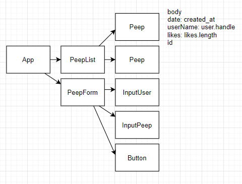

# Chitter Challenge with React

This is the frontend of a twitter clone written in React.
The frontend app talks to a backend API, and it allows users to view and post messages.
Writing this application I focused on code quality, while exploring React testing.

### Tech stack
* React
* React testing library
* Jest
* Postman for exploring the backend API

### How to use
* Clone this repo
* Navigate to the local repo, and start the server:
```
npm start
```
* Open [http://localhost:3000](http://localhost:3000) to view the app in the browser.

### How to run the tests
* Navigate to the local repo.
* In a terminal window, type:
```
npm test
```
This will run the `jest` snapshot tests.  
To run the integration tests, type in the terminal window:
```
npx cypress open
```


### My approach
I've decided to make this project a learning opportunity to explore testing libraries for React, as well as practicing React.  

#### User stories
```
As a user
So that I can see what others are saying  
I want to see all peeps in reverse chronological order
```
```
As a user
So that I can better appreciate the context of a peep
I want to see how long ago it was made
```
```
As a user
So that I can let people know what I am doing  
I want to post a message (peep) to chitter
```
```
As a user
So that I can see details of a peep
I want to see individual peeps
```

#### A simple model of the app

